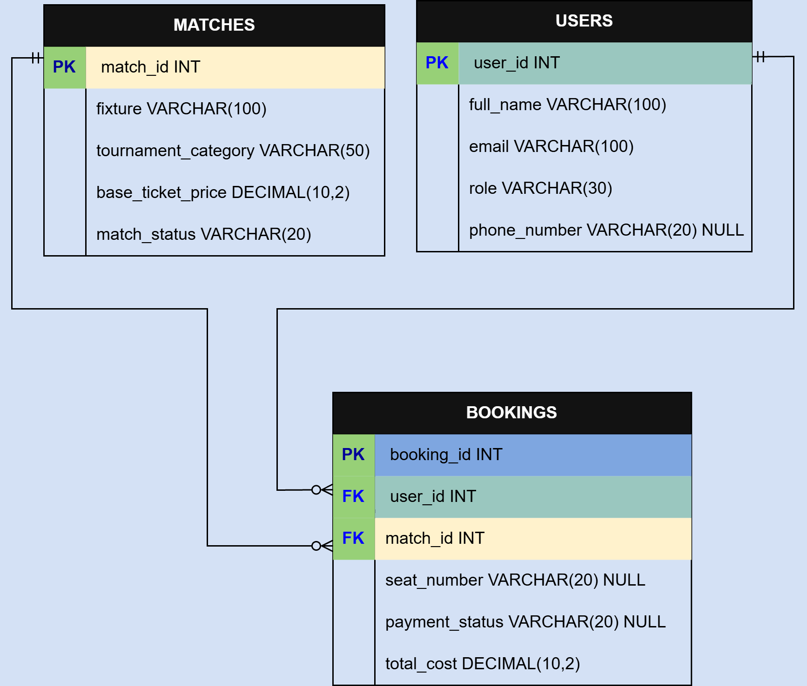

# Football Ticket Booking System

This repository contains my Assignment 3 for the Database Management System (DBMS) course.

The project is built using PostgreSQL. It includes database design, an Entity Relationship Diagram (ERD), sample data, and the required SQL queries.

---

## Project Overview

The Football Ticket Booking System manages three main things:

- Users
- Football Matches
- Ticket Bookings

The database is designed to maintain relationships between these tables using Primary Keys and Foreign Keys.

---

## ERD

<p align="center">
  
</p>

---

## Database Tables

### Users

Stores information about users.

| Column |
|---------|
| user_id |
| full_name |
| email |
| role |
| phone_number |

---

### Matches

Stores football match information.

| Column |
|---------|
| match_id |
| fixture |
| tournament_category |
| base_ticket_price |
| match_status |

---

### Bookings

Stores ticket booking records.

| Column |
|---------|
| booking_id |
| user_id |
| match_id |
| seat_number |
| payment_status |
| total_cost |

---

## Relationships

- One User can have many Bookings.
- One Match can have many Bookings.
- Each Booking belongs to one User and one Match.

---

## SQL Topics Covered

- CREATE TABLE
- PRIMARY KEY
- FOREIGN KEY
- INSERT INTO
- SELECT
- WHERE
- LIKE
- ILIKE
- IS NULL
- COALESCE
- INNER JOIN
- LEFT JOIN
- Subquery
- AVG()
- ORDER BY
- LIMIT
- OFFSET

---

## Folder Structure

```
ASSIGNMENT-3
│
├── ERD
│   ├── football_ticket_booking_erd.drawio
│   └── football_ticket_booking_erd.png
│
├── QUERY
│   └── QUERY.sql
│
├── Screenshot
│   ├── QUERY_1.png
│   ├── QUERY_2.png
│   ├── QUERY_3.png
│   ├── QUERY_4.png
│   ├── QUERY_5.png
│   ├── QUERY_6.png
│   └── QUERY_7.png
│
└── README.md
```

---

## How to Run

1. Open PostgreSQL (pgAdmin).
2. Create a database.
3. Open the `QUERY.sql` file.
4. Run the script to create the tables and insert the sample data.
5. Execute the required queries.

---

## Screenshots

The repository includes screenshots of all required SQL query outputs.

- Query 1
- Query 2
- Query 3
- Query 4
- Query 5
- Query 6
- Query 7

---

## Author

**Chinmoy Sarkar**

Department of Computer Science and Engineering

Bangladesh Army International University of Science and Technology (BAIUST)

This repository contains my solution for Assignment 3 of the Programming Hero Next Level Web Development Batch-7 course. The project demonstrates the design and implementation of a Football Ticket Booking System using PostgreSQL.